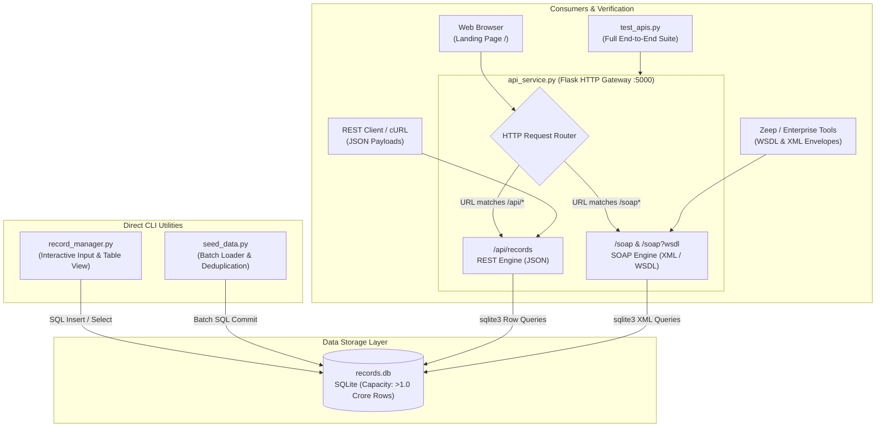

### System Architecture Overview

The system is organized around a sovereign, local-first SQLite database ([records.db](file:///e:/temp_ue_pjts_zips/GASCollect/records.db)) consumed by two entry channels: direct CLI scripts and a dual-protocol Web API service.



---

### Technologies Used & Layman Problems Solved

| Technology | Usage Intro | The Layman Problem Solved | Open Source Status & License |
| :--- | :--- | :--- | :--- |
| **[SQLite 3](https://www.sqlite.org/)** | Embedded serverless SQL engine | Eliminates the need to install, configure, or administer external database servers (like PostgreSQL/MySQL). | Public Domain / Open Source |
| **[Flask 3.1.3](https://github.com/pallets/flask)** | Lightweight WSGI web application framework | Removes boilerplate web server configuration, routing HTTP requests to Python functions in seconds. | Open Source ([BSD-3-Clause](https://palletsprojects.com/p/flask/)) |
| **[Zeep 4.3.2](https://github.com/mvantellingen/python-zeep)** | Pure-Python SOAP client library | Automatically generates callable Python methods directly from a remote WSDL without writing manual XML. | Open Source ([MIT](https://github.com/mvantellingen/python-zeep)) |
| **[ElementTree](https://docs.python.org/3/library/xml.etree.elementtree.html)** | Standard XML parsing and serialization engine | Enables safe parsing of structured SOAP XML envelopes without third-party XML runtime bloat. | Open Source ([PSF License](https://docs.python.org/3/license.html)) |

---

### Step-by-Step Breakdown of What Is Happening

#### 1. Data Ingestion & Storage Mechanics
* **Database File**: [records.db](file:///e:/temp_ue_pjts_zips/GASCollect/records.db) is stored directly on the local filesystem.
* **Schema Definition**: A table named `records` is created automatically on first run:
  ```sql
  CREATE TABLE IF NOT EXISTS records (
      id INTEGER PRIMARY KEY AUTOINCREMENT,
      name TEXT NOT NULL,
      email TEXT NOT NULL,
      notes TEXT,
      created_at TEXT NOT NULL
  );
  ```
* **Capacity & Scalability**: SQLite supports single tables storing well over **1.0 to 1.5 crore rows** (10,000,000+ entries) with microsecond index seek times on disk.

---

#### 2. The Direct CLI Scripts
* **Interactive Manager ([record_manager.py](file:///e:/temp_ue_pjts_zips/GASCollect/record_manager.py))**:
  * Blocks on standard input to capture `Name`, `Email`, and `Notes`.
  * Validates strings via regular expressions before database execution.
  * Writes the record using parameterized SQL (`?`) to guarantee SQL-injection protection.
  * Queries the database immediately and renders an ASCII table containing all historical entries.
* **Batch Loader ([seed_data.py](file:///e:/temp_ue_pjts_zips/GASCollect/seed_data.py))**:
  * Pushes 10 structured engineering profiles in a single atomic transaction.
  * Performs deduplication by querying `email` before inserting, ensuring idempotent re-runs.

---

#### 3. The Dual REST & SOAP Gateway ([api_service.py](file:///e:/temp_ue_pjts_zips/GASCollect/api_service.py))

A single Flask instance running on `http://127.0.0.1:5000` listens for inbound traffic and delegates requests to either the REST or SOAP subsystem based on the URL path:

##### A. The REST Subsystem (`/api/records`)
* **Format**: Pure JSON payloads.
* **Standard HTTP Methods**:
  * `GET /api/records`: Fetches all rows, serializes them to JSON arrays, and returns HTTP `200 OK`.
  * `GET /api/records/<id>`: Fetches a single record; returns `404 Not Found` if missing.
  * `POST /api/records`: Parses JSON body `{"name": "...", "email": "...", "notes": "..."}`, validates input, inserts into SQLite, and returns HTTP `201 Created`.
  * `DELETE /api/records/<id>`: Deletes the target ID and returns HTTP `200 OK`.

##### B. The SOAP Subsystem (`/soap` & `/soap?wsdl`)
* **Format**: XML wrapped inside SOAP Envelopes.
* **WSDL Generation (`GET /soap?wsdl`)**:
  * Returns an XML document describing the service contracts, data types (`RecordType`), input/output messages, and the binding port `http://127.0.0.1:5000/soap`.
  * Allows enterprise clients (such as Zeep, SAP, Java Spring, or Salesforce) to discover the available operations automatically.
* **RPC Execution (`POST /soap`)**:
  1. The server reads the XML request body.
  2. The XML parser traverses the `<soap:Envelope>` and locates `<soap:Body>`.
  3. The target operation tag is extracted:
     * `<GetAllRecordsRequest>` &rarr; Queries database, formats records into XML, and responds with `<GetAllRecordsResponse>`.
     * `<GetRecordRequest>` &rarr; Extracts `<Id>`, queries the record, and responds with `<GetRecordResponse>`.
     * `<CreateRecordRequest>` &rarr; Extracts `<Name>`, `<Email>`, and `<Notes>`, writes to the database, and responds with `<CreateRecordResponse>`.
  4. If an invalid payload is sent, a standardized `<soap:Fault>` XML response is returned with HTTP 500 status.

---

#### 4. The Verification Test Suite ([test_apis.py](file:///e:/temp_ue_pjts_zips/GASCollect/test_apis.py))

When [test_apis.py](file:///e:/temp_ue_pjts_zips/GASCollect/test_apis.py) runs, it executes three test passes against the running gateway:
1. **REST Test**: Issues HTTP GET and POST requests using `requests.json()`, validating response status codes and created record IDs.
2. **Raw SOAP XML Test**: Dispatches handcrafted XML strings containing `<soapenv:Envelope>` with `Content-Type: text/xml`, then parses the returned XML using Python's `ElementTree`.
3. **Enterprise WSDL Client Test**: Instantiates `zeep.Client("http://127.0.0.1:5000/soap?wsdl")`. Zeep parses the WSDL schema over HTTP, dynamically binds Python methods (`client.service.GetAllRecords()`, `client.service.CreateRecord(...)`), and executes the SOAP RPC calls as native Python function calls.

---

### Command Execution Reference (DOS / Command Prompt)

To re-run any stage of the system from Windows Command Prompt:

```cmd
python record_manager.py
```

```cmd
python seed_data.py
```

```cmd
python test_apis.py
```